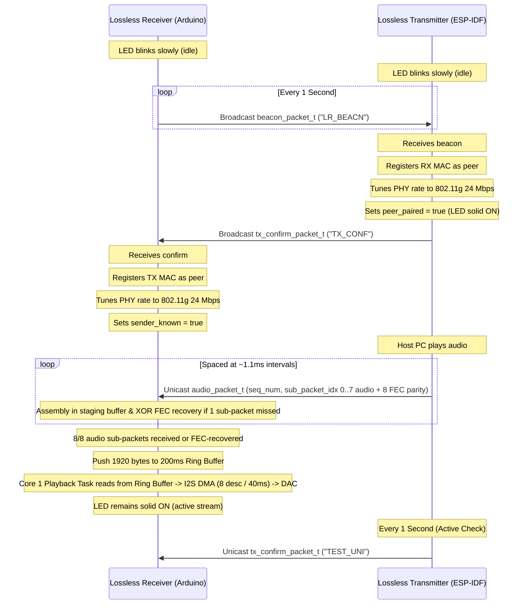

# Lossless Audio over ESP-NOW: Developer & AI Agent Guide (`AGENTS.md`)

This guide is designed for future developers and AI coding assistants (agents) working on this repository. It explains the system architecture, custom communication protocols, hard-won workarounds, configuration parameters, and build/flash instructions.

---

## 1. Repository Architecture & Components

The repository implements a low-latency, high-fidelity wireless audio link (48kHz, 16-bit, stereo) between a computer and a DAC-connected speaker, using **ESP-NOW** (bypassing the overhead and latency of TCP/IP WiFi).

```
+------------------+                   +------------------+
|    Host PC       |                   |   PCM5102 DAC    |
| (USB Audio Host) |                   |  (I2S Receiver)  |
+--------+---------+                   +--------+---------+
         | USB (UAC 1.0)                        ^ I2S Standard
         v                                      | (GPIO 4, 5, 6)
+--------+---------+      ESP-NOW Unicast       +--------+---------+
|   lossless_tx    | =========================> |   lossless_rx    |
|  (Transmitter)   |  (802.11g 24 Mbps OFDM)   |   (Receiver)     |
+------------------+                        	+------------------+
```

### Components:
*   **[`lossless_tx/`](file:///C:/Users/qingc/Projects/lossless_audio/lossless_tx)**: Transmitter firmware. Built using the **ESP-IDF framework** with PlatformIO. It enumerates as a USB Audio Class (UAC) 1.0 device on a Seeed Studio XIAO ESP32S3, receives stereo PCM streams from the PC, and streams them packetized over ESP-NOW with XOR FEC parity.
*   **[`lossless_rx/`](file:///C:/Users/qingc/Projects/lossless_audio/lossless_rx)**: Receiver firmware. Built using the **Arduino framework** with PlatformIO. It receives ESP-NOW packets, reconstructs 10ms audio frames (recovering single missing packets via FEC parity), buffers them in a 200ms ring buffer, and outputs I2S audio via DMA to a PCM5102 DAC.
*   **[`usb_dac_espidf/`](file:///C:/Users/qingc/Projects/lossless_audio/usb_dac_espidf)**: Reference prototype. Demonstrates a single-board USB DAC using ESP-IDF, playing UAC audio directly through local I2S.
*   **[`usb_audio_dac/`](file:///C:/Users/qingc/Projects/lossless_audio/usb_audio_dac)**: Reference prototype. Demonstrates a single-board USB DAC using Arduino and the `AudioTools` library.

---

## 2. Data Flow & Communication Protocol

### Audio Frame Metrics
*   **Audio Format**: 48,000 Hz, 16-bit, Stereo (2 channels).
*   **Throughput**: $48,000 \times 2\text{ bytes} \times 2\text{ channels} = 192,000\text{ bytes/second}$ ($192\text{ bytes/ms}$).
*   **10ms Frame**: Represents 480 stereo samples. Total size = $1920\text{ bytes}$.
*   **ESP-NOW Packets**: Divided into **9 sub-packets** per 10ms frame:
    *   Sub-packets `0` to `7`: Audio payload ($240\text{ bytes}$ each).
    *   Sub-packet `8`: XOR Parity sub-packet ($240\text{ bytes}$) for Forward Error Correction (FEC).

### Packet Structs
Both components must use exact matching packed structs:

```c
// Size: 248 bytes
typedef struct __attribute__((packed)) {
    uint32_t seq_num;          // Incremented for every 10ms frame
    uint8_t sub_packet_idx;    // 0 to 7 (Audio), 8 (FEC Parity)
    uint8_t total_sub_packets; // Always 9
    uint16_t payload_len;      // Always 240
    uint8_t audio_data[240];   // Stereo interleaved samples or XOR parity
} audio_packet_t;

// Size: 14 bytes
typedef struct __attribute__((packed)) {
    char magic[8];             // "LR_BEACN"
    uint8_t mac[6];            // Receiver MAC address
} beacon_packet_t;

// Size: 24 bytes
typedef struct __attribute__((packed)) {
    char magic[8];             // "TX_CONF" or "TEST_UNI"
    uint8_t transmitter_mac[6];// Transmitter MAC address
    uint8_t receiver_mac[6];   // Receiver MAC address
    uint32_t seq_num;          // Diagnostics sequence index
} tx_confirm_packet_t;

// Size: 9 bytes
typedef struct __attribute__((packed)) {
    char magic[8];             // "MEDIA_CTL"
    uint8_t command;           // 1 = Play/Pause, 2 = Next Track (Skip), 3 = Prev Track (Back)
} media_control_packet_t;
```

```

### Pairing Handshake Sequence



---

## 3. Hard-Won Workarounds & Design Decisions (Crucial Checklist)

When editing code, do **NOT** undo these critical fixes:

### 1. Wi-Fi Channel Lock Workaround (No-AP, Channel 8)
*   **The Issue**: ESP-NOW requires transmitter and receiver to be on the same radio channel. Setting this in station mode normally requires connecting to an AP, while running softAP mode consumes excessive radio airtime and causes packet dropouts.
*   **The Workaround**: Initialize Wi-Fi in pure station mode (`WIFI_MODE_STA`), temporarily enable promiscuous mode, change the channel to **Channel 8** (selected via local 2.4 GHz spectrum scan to avoid local AP congestion on Channel 11), and then disable promiscuous mode. This forces the radio lock without launching an AP.
    *   **ESP-IDF Implementation** ([`lossless_tx/src/main.c`](file:///C:/Users/qingc/Projects/lossless_audio/lossless_tx/src/main.c)):
        ```c
        ESP_ERROR_CHECK(esp_wifi_set_mode(WIFI_MODE_STA));
        ESP_ERROR_CHECK(esp_wifi_start());
        ESP_ERROR_CHECK(esp_wifi_set_promiscuous(true));
        ESP_ERROR_CHECK(esp_wifi_set_channel(8, WIFI_SECOND_CHAN_NONE));
        ESP_ERROR_CHECK(esp_wifi_set_promiscuous(false));
        ```
    *   **Arduino Implementation** ([`lossless_rx/src/main.cpp`](file:///C:/Users/qingc/Projects/lossless_audio/lossless_rx/src/main.cpp)):
        ```cpp
        WiFi.mode(WIFI_STA);
        esp_wifi_set_promiscuous(true);
        esp_wifi_set_channel(8, WIFI_SECOND_CHAN_NONE);
        esp_wifi_set_promiscuous(false);
        ```

### 2. Sequential ESP-NOW Transmission Spacing
*   **The Issue**: Bursting 9 sub-packets (2160 bytes) all at once every 10ms overflows the internal ESP-NOW transmit queues/buffers and results in massive packet loss.
*   **The Workaround**: In the UAC output callback, write code to process audio in chunks of 240 bytes and transmit each sub-packet *immediately* as it accumulates, followed by the 9th parity sub-packet. Because the PC host sends small packets of ~192 bytes every 1ms, this naturally spreads out transmissions to roughly one packet every 1.1ms, keeping the queue completely clear.

### 3. Forward Error Correction (XOR Parity Sub-packet)
*   **The Issue**: Single wireless packet dropouts cause audible pops and clicks if missing slots are zero-filled.
*   **The Workaround**: Transmit a 9th sub-packet per frame containing the byte-wise XOR parity of all 8 audio sub-packets. If the receiver misses any single sub-packet out of 8, it reconstructs it instantly using the parity payload with zero round-trip latency.

### 4. ESP-NOW PHY Rate Tuning (802.11g 24 Mbps)
*   **The Issue**: Default ESP-NOW uses slow 802.11b rates (e.g. 1 Mbps CCK) or auto-fallback rates, which increases airtime per packet. At ~900 packets/second, long airtime causes congestion and collisions.
*   **The Workaround**: Programmatically configure the registered peer rate to use **802.11g 24 Mbps (OFDM)**. This offers the best trade-off between short airtime and long-range reception:
    ```c
    esp_now_rate_config_t rate_cfg = {
        .phymode = WIFI_PHY_MODE_11G,
        .rate = WIFI_PHY_RATE_24M,
        .ersu = false,
        .dcm = false,
    };
    esp_now_set_peer_rate_config(peer_mac, &rate_cfg);
    ```

### 5. PCM5102 Right-Channel Silence Fix
*   **The Issue**: The external PCM5102 I2S DAC drops the right channel (producing silence on the right speaker) if the I2S slot bit width is left default or configured to 32-bit for a 16-bit stream.
*   **The Workaround**: Explicitly set the I2S slot bit width to 16-bit inside the receiver I2S configuration:
    ```cpp
    std_cfg.slot_cfg.slot_bit_width = I2S_SLOT_BIT_WIDTH_16BIT;
    ```

### 6. USB Host Descriptor Caching Bypass (PID `0x8002`)
*   **The Issue**: Windows and macOS cache USB descriptor tables. If the channel count, sample rate, or bit resolution are changed in firmware, the host OS ignores the changes and uses cached values, causing playback errors.
*   **The Workaround**: Increment the USB Product ID (PID) to `0x8002` in [`usb_descriptors.c`](file:///C:/Users/qingc/Projects/lossless_audio/lossless_tx/src/usb_descriptors.c) whenever audio configurations are updated. This forces the host OS to recognize it as a brand-new device.

### 7. ESP-IDF UAC ABI Layout Configuration & Core Pinning
*   **The Issue**: The `usb_device_uac.h` header changes its struct layouts based on macros defined in `sdkconfig.h` (e.g. `CONFIG_USB_DEVICE_UAC_AS_PART`). If `sdkconfig.h` is not included at the top of code referencing UAC configuration, silent ABI layout mismatches will break callbacks.
*   **The Workaround**: Always include `"sdkconfig.h"` before any other headers in transmitter files (e.g. [`lossless_tx/src/main.c`](file:///C:/Users/qingc/Projects/lossless_audio/lossless_tx/src/main.c)). Pin TinyUSB and UAC tasks to Core 0 (`CONFIG_UAC_TINYUSB_TASK_CORE=0`, `CONFIG_UAC_SPK_TASK_CORE=0`) in `sdkconfig.defaults`, and pin the receiver playback task to Core 1 with 8KB stack size.

### 8. High Quality (Bit-Exact) vs Low Latency Mode Flag & Hardware Switch Support
*   **The Issue**: Resampling drift compensation locks buffer depth to ~35ms for gaming/movies, but can introduce micro-crackling during aggressive drops. Audiophiles desire pure, untouched 100% bit-exact 48kHz PCM audio playback.
*   **The Solution**: Place drift compensation behind a runtime flag `config_low_latency_mode`.
    *   **High Quality Mode (`ENABLE_DRIFT_COMPENSATION_DEFAULT = 0`)**: Pure 100% bit-exact 48kHz PCM playback. Zero sample drops, zero sample dups, zero crackles.
    *   **Low Latency Mode (`ENABLE_DRIFT_COMPENSATION_DEFAULT = 1`)**: Zero-crossing drift compensation enabled, locking latency to ~35ms target.
    *   **Hardware Switch Pin (`MODE_SWITCH_PIN = GPIO_NUM_7`)**: Configured with `INPUT_PULLDOWN` on GPIO 7 (D8 pin on Seeed Studio XIAO ESP32S3). Bridging GPIO 7 to `3.3V` (HIGH) dynamically activates Low-Latency Mode; disconnecting or bridging to `GND` (LOW) reverts to High-Quality Mode.
    *   **Instant 35ms Buffer Flush**: When switching into Low-Latency Mode or when buffer depth exceeds 100ms in Low-Latency Mode, the receiver instantly discards excess stale frames down to 35ms (<1ms flush duration), bypassing slow drift draining.

---

## 4. Hardware Pinout & Specs (Seeed Studio XIAO ESP32S3)

*   **Status LED**: `GPIO 21` (Onboard orange LED, **active-low**: write `0`/`LOW` to turn ON, `1`/`HIGH` to turn OFF).
*   **I2S Pins for PCM5102 DAC**:
    *   `GPIO 4` (D3 Pin) -> **I2S BCLK** (Bit Clock / BCK)
    *   `GPIO 5` (D4 Pin) -> **I2S WS** (Word Select / LRCK)
    *   `GPIO 6` (D5 Pin) -> **I2S DOUT** (Data Output / DIN)
*   **Hardware Volume Buttons**:
    *   `GPIO 1` (D0 Pin) -> **Volume Up Button** (Momentary Push Button, Active-Low / internal `INPUT_PULLUP` to GND)
    *   `GPIO 2` (D1 Pin) -> **Volume Down Button** (Momentary Push Button, Active-Low / internal `INPUT_PULLUP` to GND)
*   **Media Control Button**:
    *   `GPIO 3` (D2 Pin) -> **Multi-Tap Media Button** (Momentary Push Button, Active-Low / internal `INPUT_PULLUP` to GND)
        *   **1 Tap**: Play / Pause
        *   **2 Taps**: Next Track (Skip)
        *   **3+ Taps**: Previous Track (Back)
*   **Mode Switch Pin**: `GPIO 7` (D8 Pin) -> Hardware Mode Switch (Bridge to `3.3V` = Low Latency, `GND`/Open = High Quality).

*   **Power & Ground**: Connect 3.3V or 5V to the DAC power, and connect GND common.

---

## 5. Status & Diagnostic Indications

### Status LED Blink Codes

| Device | State / Indication | Blink Pattern |
|---|---|---|
| **Transmitter** | Searching for Receiver | Slow blink (500ms ON / 500ms OFF) |
| **Transmitter** | Paired, but PC Audio is Idle | Solid ON |
| **Transmitter** | Paired & Streaming Audio | Rapid blink (100ms ON / 100ms OFF) |
| **Transmitter** | High ESP-NOW TX failure rate | Double-flash flash pattern followed by 500ms pause |
| **Receiver** | Idle / Waiting for Transmitter | Brief flash every 1 second (beacon transmission) |
| **Receiver** | Actively receiving audio stream | Solid ON |

### Diagnostic Console Prints (Receiver)
The receiver prints detailed link health statistics every 1 second over its serial interface:
```text
[LINK STATUS] Mode: High-Quality | Chan: 8 | Frames: 100/s (100 real, 0 FEC, 0 silence) | Sub-pkts: 900/s (Exp: ~900) | Buffer: 36480 B (190.0 ms) | Drift: 0 drop/s, 0 dup/s | Underflows: 0/s | Overflows: 0/s
```
*   **Active Mode**: `High-Quality` (pure bit-exact PCM) or `Low-Latency` (drift compensation enabled).
*   **Expected Frames**: ~100/s (1 frame per 10ms).
*   **Frame Breakdown**: `real` (fully received audio sub-packets), `FEC` (recovered via XOR parity), `silence` (unrecoverable missing frames).
*   **Expected Sub-packets**: ~900/s (8 audio + 1 FEC sub-packet per frame).
*   **Underflows / Overflows**: Should ideally be 0. If underflows occur, Packet Loss Concealment (PLC) softly attenuates the last good frame while rebuffering.

---

## 6. Build, Flash & CLI Tool Commands

Since standard global terminal pathways may not resolve PlatformIO directly, use the dedicated Python environment scripts.

### Build & Upload the Receiver (`lossless_rx`)
Run from the repository root:
```powershell
# Build firmware
& "$HOME\.platformio\penv\Scripts\platformio.exe" run -d lossless_rx

# Upload / Flash firmware to device
& "$HOME\.platformio\penv\Scripts\platformio.exe" run -d lossless_rx -t upload

# Open Serial Monitor for logs (Receiver uses CDC USB-Serial on Boot)
& "$HOME\.platformio\penv\Scripts\platformio.exe" device monitor -d lossless_rx
```

### Build & Upload the Transmitter (`lossless_tx`)
Run from the repository root:
```powershell
# Build firmware (compiles using ESP-IDF toolchain)
& "$HOME\.platformio\penv\Scripts\platformio.exe" run -d lossless_tx

# Upload / Flash firmware
& "$HOME\.platformio\penv\Scripts\platformio.exe" run -d lossless_tx -t upload
```

### Troubleshooting Checklist for Agents
1.  **Audio has Right-channel silence?** Check if `slot_bit_width` is explicitly configured to 16-bit in the receiver setup.
2.  **Transmitter is unrecognized by PC Host?** Verify the USB PID in `lossless_tx/src/usb_descriptors.c` is set to `0x8002` (or incremented if configurations changed).
3.  **Audible crackles or packet drops?** Check if the transmitter is bursting packets. Verify that it uses the sequential transmission path spacing instead of bursting.
4.  **No link established?** Check if both boards have locked onto Wi-Fi **Channel 8** using the promiscuous mode workaround.
